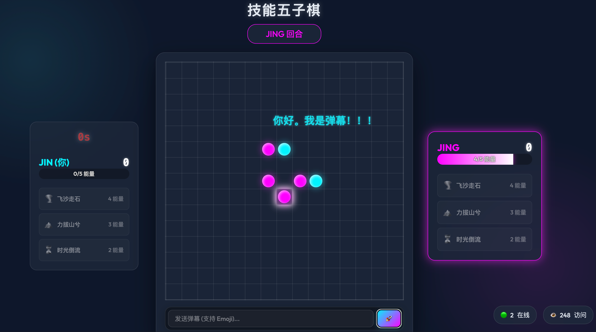

# 技能五子棋 🔮

一款现代化、赛博朋克风格的五子棋游戏，融入战略技能系统！支持在线对战、技能释放，享受极致的视觉体验。

## ✨ 核心特性

### 🎮 游戏玩法
*   **经典核心**：传统 15x15 五子棋玩法
*   **技能系统**：三种独特技能增加策略深度
    *   **🌪️ 飞沙走石（4能量）**：连续放置两颗棋子，掌控节奏
    *   **🏔️ 力拔山兮（3能量）**：夺取对手的棋子，转换为己方颜色
    *   **⏳ 时光倒流（2能量）**：移除棋盘上的一颗棋子，逆转局势
*   **能量机制**：
    *   每回合自动恢复 1 点能量（上限 5 点）
    *   超时惩罚：每次超时扣除 1 点能量
    *   能量降至 -5 判负
*   **技能音效**：每个技能都有独特的音效反馈
    *   飞沙走石：呼啸的风声
    *   力拔山兮：震撼的重击低音
    *   时光倒流：科幻倒转音效

### 🌐 联机对战
*   **随机匹配**：快速匹配在线对手
*   **私人房间**：创建房间并分享房间号给好友
*   **本地双人**：同屏对战模式
*   **实时同步**：基于 Socket.io 的实时通信
*   **随机先手**：每局游戏随机决定先手玩家，公平竞技

### 💬 社交互动
*   **弹幕系统**：发送实时评论，弹幕以随机速度从屏幕飞过
*   **昵称系统**：自定义您的战斗身份
*   **计分板**：连续对局积分累积
*   **对战统计**：实时显示在线人数和访问记录

### 🎨 现代 UI/UX
*   **玻璃拟态设计**：流畅的半透明界面
*   **霓虹美学**：赛博朋克风格视觉效果
*   **响应式布局**：完美支持桌面、平板和移动设备
*   **流畅动画**：精心设计的过渡和反馈效果
*   **技能高亮**：选中技能时按钮高亮提示
*   **破坏标记**：被时光倒流破坏的位置会显示虚线圆圈标记，2回合后恢复

## 🚀 快速开始

### 环境要求

*   [Node.js](https://nodejs.org/) (v14 或更高版本)
*   npm (Node 包管理器)

### 本地开发

1.  **克隆仓库**
    ```bash
    git clone https://github.com/yourusername/skill-gomoku.git
    cd skill-gomoku
    ```

2.  **安装依赖**
    ```bash
    npm install
    ```

3.  **启动服务器**
    ```bash
    npm start
    ```
    或者使用自动重启的开发模式（需要安装 nodemon）：
    ```bash
    npm run dev
    ```

4.  **开始游戏**
    打开浏览器访问 `http://localhost:3000`

## 🎯 游戏规则

### 基础规则
1.  玩家轮流在棋盘上放置棋子（青色 vs 品红色）
2.  率先连成 5 颗棋子（横向、纵向或对角线）即获胜
3.  每回合限时 30 秒

### 能量与技能
*   **能量获取**：每轮回开始时自动恢复 1 点能量（上限 5 点）
*   **技能释放**：
    *   点击技能按钮激活技能（飞沙走石立即生效，其他技能需选择目标）
    *   点击棋盘执行技能效果
    *   再次点击技能按钮可取消选择
*   **超时惩罚**：
    *   每次超时扣除 1 点能量
    *   能量降至 -5 时判负

### 技能详解
*   **飞沙走石（🌪️）**：激活后连续放置 2 颗棋子，无需等待对手回合
*   **力拔山兮（🏔️）**：夺取对手的一颗棋子，将其转换为己方颜色
*   **时光倒流（⏳）**：移除棋盘上的一颗棋子，该位置显示虚线标记并被封锁 2 回合

## 📦 生产部署

详细的部署指南请参考 [部署文档](deployment_guide.md)。

快速部署步骤：

1.  **上传代码到服务器**
2.  **安装依赖**: `npm install`
3.  **使用 PM2 启动**: `pm2 start server.js --name skill-gomoku`
4.  **配置反向代理**（Nginx/Caddy）
5.  **访问您的域名**

## 🛠️ 技术栈

*   **前端框架**: 原生 HTML5、CSS3、JavaScript
*   **后端框架**: Node.js + Express
*   **实时通信**: Socket.io
*   **音效系统**: Web Audio API
*   **进程管理**: PM2
*   **反向代理**: Caddy / Nginx

## 📂 项目结构

```
skill-gomoku/
├── index.html          # 游戏主页面
├── style.css           # 样式文件（含玻璃拟态和霓虹效果）
├── script.js           # 客户端逻辑（含技能系统和音效）
├── server.js           # 服务器端逻辑（含房间管理和同步）
├── package.json        # 依赖配置
├── Caddyfile          # Caddy 配置示例
├── README.md          # 项目说明
└── deployment_guide.md # 部署指南
```

## 🎵 音效系统

游戏使用 Web Audio API 实时合成音效，无需额外资源文件：
*   **游戏开始**：清脆的上行音阶
*   **落子音效**：柔和的提示音
*   **飞沙走石**：急促的风声呼啸
*   **力拔山兮**：震撼的低频重击
*   **时光倒流**：科幻倒转音效（频率下降）
*   **胜利**：欢快的凯旋号角
*   **失败**：悲伤的下行旋律

## 🔧 最新更新

### v2.0 - 全面升级
*   ✅ **技能重命名**：更具诗意的技能名称
*   ✅ **自定义音效**：为每个技能添加专属音效
*   ✅ **破坏标记优化**：时光倒流后的封锁标记更加清晰
*   ✅ **技能高亮反馈**：选中技能时按钮高亮提示
*   ✅ **随机先手修复**：在线对战正确实现随机先手
*   ✅ **能量扣除修复**：修复飞沙走石重复扣能量的问题
*   ✅ **UI 优化**：提升整体视觉体验和交互反馈

## 🎮 游戏截图



## 🤝 贡献指南

欢迎提交 Issue 和 Pull Request！

## 📄 开源协议

本项目采用 [MIT License](LICENSE) 开源协议。

---

使用 ❤️ 制作

